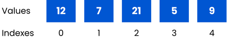

# Arrays (list)

Arrays are a linear data structure that arrange items sequentially, one after another, in the computer’s memory. Arrays are index-based, meaning values can be accessed using their index number.

## Static arrays vs Dynamic arrays

Static arrays, also known as fixed-size arrays in programming languages like C and C++, require the size of the array to be specified during declaration, and it cannot be changed during runtime. However, in modern programming languages like JavaScript and Python, the size of an array is dynamic, meaning more items can be added or removed as needed.

## Implementation of Arrays in different programming languages

The implementation of arrays can differ in different programming languages. Arrays in languages like JavaScript and Python can store different types of data (like numbers, strings, etc.), but arrays in languages like Java and C++ can only store a single type of data.
